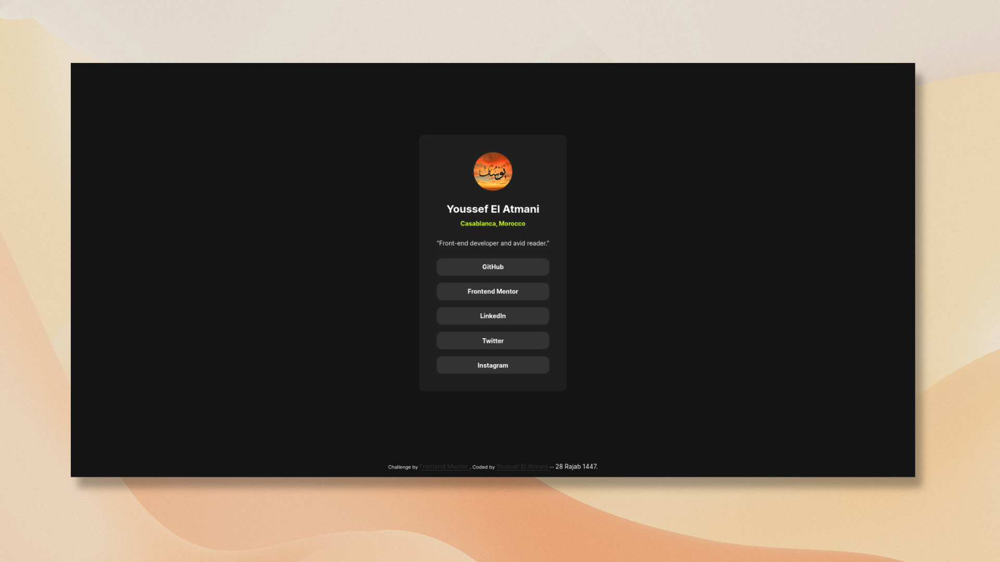

# Frontend Mentor - Social links profile solution

This is a solution to the [Social links profile challenge on Frontend Mentor](https://www.frontendmentor.io/challenges/social-links-profile-UG32l9m6dQ). Frontend Mentor challenges help you improve your coding skills by building realistic projects.

## Table of contents

- [Overview](#overview)
  - [The challenge](#the-challenge)
  - [Screenshot](#screenshot)
  - [Links](#links)
- [My process](#my-process)
  - [Built with](#built-with)
  - [What I learned](#what-i-learned)
  - [Continued development](#continued-development)
- [Author](#author)

**Note: Delete this note and update the table of contents based on what sections you keep.**

## Overview

### The challenge

Users should be able to:

- See hover and focus states for all interactive elements on the page

### Screenshot

### Links

- Live Site URL: [social-links-profile](https://youssef-el-atmani.github.io/social-links-profile/)

## My process

### Built with

- Semantic HTML5 markup
- CSS custom properties
- Flexbox

### What I learned

I learned that the `address` element should only used to wrap the contact info, I said nothing new, but the problem was how I thought it is used, I thought whenever you see an _email, or location, or phone_, I thought it should be wrapped in `<address>` element, and what I learned is that that only valid if it is part of contact info, it doesn't matter if it is a single person contact, or website contact, or an organization contact.

### Continued development

- I will try to improve my understanding of the HTML elements, so that I can use the right HTML elements for the right things.
- I will continually improving my documentation abilities, precisely writing good commit messages.

## Author

- Frontend Mentor - [@youssef-el-atmani](https://www.frontendmentor.io/profile/youssef-el-atmani)
- Twitter - [@y_el_atmani](https://x.com/y_el_atmani)

## Attribution

The background image used in the [screenshot](#screenshot) is by [Pawel Czerwinski](https://unsplash.com/@pawel_czerwinski) on **Unsplash**.
